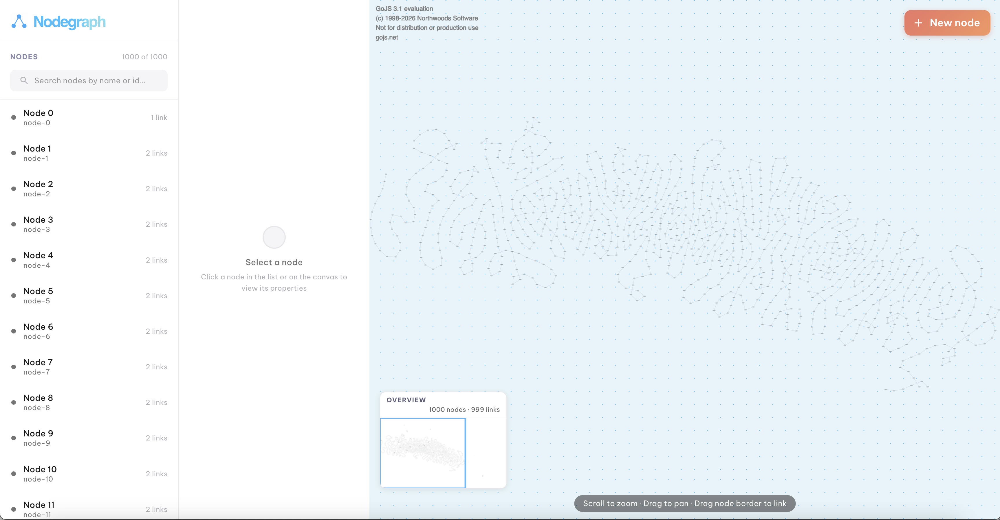
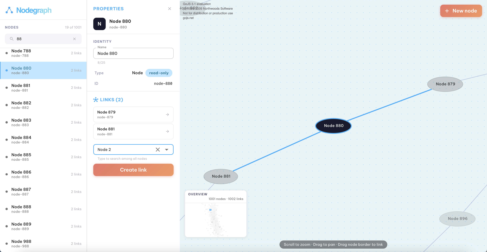
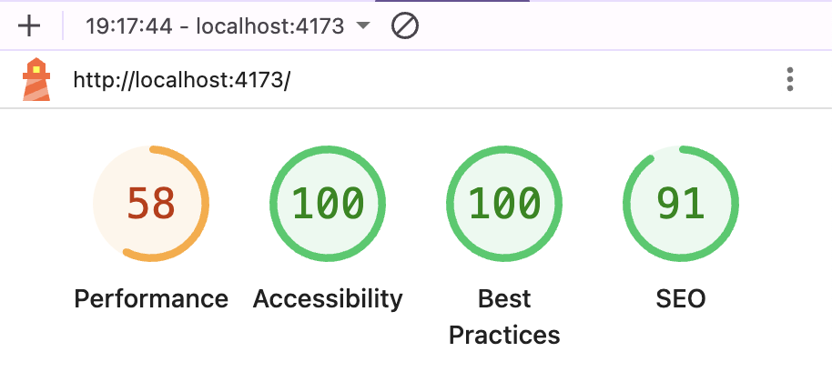

# Nodegraph

A diagram editor for visualizing and managing large node networks, built with React, TypeScript, GoJS, and MUI.

1000 nodes dataset : 
> 96.58% test coverage · Performance 80 (Lighthouse, production build) · Accessibility 100 · Best Practices 100





---

## Getting started

Requires **Node.js 20.19+ or 22.12+** (Vite 8 constraint).

```bash
nvm use
npm install
npm run dev       # dev server
npm run test      # jest test suite
npm run build     # production build
npm run preview   # serve the production build locally
npx prettier --write "src/**/*.{ts,tsx}"  # format
```

---

## Approach

The goal was to build something that felt fast and usable at 1 000 nodes — not just technically correct at that scale but actually pleasant to interact with. Every structural decision was made with that constraint in mind: where state lives, how the diagram synchronizes, how the list renders, how updates propagate without blocking the UI.

Scalability and maintainability were treated as first-class constraints, not afterthoughts. State is centralised in a single hook with no duplication. Types are kept in separate files to anticipate divergence. The diagram is isolated in its own feature domain rather than mixed into shared UI components. Pure utility functions are decoupled from rendering logic and tested independently. The result is a codebase where each layer has a single responsibility and can be extended or replaced without cascading changes.

The end user was a constant reference point throughout. Technical correctness was never enough on its own — each feature was evaluated against how it would feel to use: does the selected node center itself immediately? does the panel stay open when drawing a link? does the input stay responsive while typing a name? does switching nodes feel instant? That lens shaped as many decisions as the performance constraint did.

Edge cases were handled with the same seriousness as core features: empty names, duplicate names, self-links, switching nodes while an edit is in progress, mobile tap behavior, the panel appearing mid-session. Each one was identified, handled, and tested.

Beyond the core requirements, I proactively added features to improve the overall experience: a minimap for orientation in large graphs, an overview counter showing the live node and link count, a search input in the node list, and autofocus on the name field when a new node is added (the name is pre-selected so the user can type immediately without an extra click). These were not asked for but felt necessary to make the tool genuinely usable at 1 000 nodes.

Design-wise, I drew inspiration from the BlueDolphin product, using their color palette and the dotted background pattern on the canvas to stay visually consistent with the brand context.

---

## Project structure

```
src/
├── app/
│   ├── App.tsx                   # layout-only: responsive tiers, no business logic
│   └── hooks/
│       └── useGraphState.ts      # all graph state and mutations in one place
├── components/
│   ├── properties/               # PropertiesPanel, IdentitySection, LinksSection
│   ├── sidepanel/                # SidePanel (search + node list + brand header)
│   └── ui/                       # GradientButton, Logo (reusable, stateless)
├── features/
│   ├── diagram/                  # GoJS canvas, overlay, and all diagram hooks/utils
│   └── nodes/                    # NodeList (virtualized)
├── theme/                        # MUI theme + design tokens
├── types/                        # NodeData, LinkData, Graph — one file per type
├── utils/                        # pure functions: generateGraph, canAddLink, etc.
└── __tests__/                    # unit tests for core operations
```

The separation between `components/` and `features/` is intentional. `components/` holds reusable UI pieces. `features/diagram/` is not a UI component — it is a full feature domain with its own business logic, lifecycle management, GoJS engine integration, and state synchronization. Putting it in `components/` would misrepresent what it is and make future extraction harder if this project ever moves toward a microservices or micro-frontend architecture.

---

## Key decisions

### GoJS integration

GoJS manages its own internal rendering state. Three things were needed to make it work reliably with React:

**Removed `<StrictMode>`** — React's StrictMode intentionally double-invokes effects to detect side effects. GoJS registers the canvas div in its own internal registry and `diagram.div = null` does not fully clear it between invocations. The result is a broken second mount. Removing StrictMode is the standard fix for GoJS + React.

**No re-initialization on re-renders** — the diagram is initialized once in `useDiagramInit`, guarded by a `useRef`. Subsequent renders push data updates through `useDiagramStructure` (model transactions) and `useDiagramSelection` (highlight/zoom), never by recreating the diagram.

**ForceDirectedLayout tuning** — the default parameters treat nodes as point masses with no knowledge of their visual bounds, so 1 000 labeled ellipses would overlap. Raising `defaultSpringLength` to 180 and `defaultElectricalCharge` to 600 gives connected nodes enough breathing room and keeps unrelated nodes repelled far enough apart that ellipses never sit on top of each other.

### State and synchronization

All graph state (`nodes`, `links`, `selectedNodeId`) lives in a single `useGraphState` hook. There is no duplicated state and no external state library.

Name editing uses a local `useState` inside `IdentitySection` to decouple keystroke rendering from the full node list re-render. `useTransition` in `updateNodeName` defers the propagation to React state so the input stays responsive. Without it, every keystroke triggers a re-render of App → SidePanel → NodeList (1 000 items) → DiagramCanvas before the input can visually update.

### Timing and animation

Two patterns appear across the codebase for synchronizing GoJS with React:

**`requestAnimationFrame` with retry** — `zoomToNode` retries itself via rAF until `node.actualBounds.width > 0`, which is GoJS's signal that it has finished rendering and measuring. This handles the case where React updates state (adding a node, drawing a link) before GoJS has rendered the new element.

**Double `requestAnimationFrame`** — when drawing a link on the canvas, node repositioning runs in the first rAF and zoom runs in the nested second rAF. This matches the timing of the side-panel linking path so the behavior is identical regardless of how a link was created.

### Node name editing

`IdentitySection` receives `key={node.id}` from its parent. Switching nodes remounts the component with fresh local state, which is simpler and more correct than a `useEffect` reset. A `useEffect` approach creates a one-render window where stale state triggers a false "duplicate name" warning flash before the reset fires.

### Virtualized node list

`NodeList` implements its own virtualization using `ResizeObserver` and scroll position math, with a fixed `ROW_HEIGHT` and an overscan buffer. No external virtualization library is used. The component handles keyboard navigation (Enter, Space) and exposes full ARIA attributes (`role="listbox"`, `aria-selected`, `aria-posinset`, `aria-setsize`).

### Mobile behavior

On mobile, GoJS can fire `ChangedSelection(null)` on touch-end immediately after a tap, which would cancel the selection before the properties drawer opens. The fix is a dedicated canvas selection handler that ignores `null` on non-desktop viewports — the panel closes via its own close button instead.

When drawing a link on the canvas, GoJS auto-selects the new link (a `go.Link`, not a `go.Node`), which previously sent `null` and closed the panel. The handler now only sends `null` when the canvas selection is truly empty (`selection.count === 0`), so clicking a link keeps the panel open on the last selected node.

### Types

`NodeData`, `LinkData`, and `Graph` are kept in separate files under `src/types/`. They are likely to diverge as the data model evolves (typed links, metadata, discriminated unions for node types), and splitting types after the fact is harder than keeping them separate from the start.

### No arrows on links

Links render as plain lines. The graph is undirected in behavior — both directions can be queried — so arrows added visual noise without functional meaning.

---

## Testing

Tests follow the **given / when / then** structure with an empty line between each block.

`describe` labels include the test category as a prefix:
- `utility` — pure functions with no side effects
- `operation` — state mutation patterns
- `component` — React component rendering and interaction

Coverage was checked with `jest --coverage` and reviewed line by line. The suite reaches **96.58% statements / 99% lines** across all tested files. The remaining gaps are deliberate:
- `LinksSection` `renderOption` — MUI renders this inside a Popper portal that does not mount in the jsdom tree; testing it would require fighting the framework for UI-only render code.
- `NodeList` scroll handler — requires real layout measurements that jsdom cannot provide.
- `Logo` default parameter branch — not a meaningful code path.

| Category | File | What it covers |
|---|---|---|
| utility | `generateGraph.test.ts` | node count, ids, names, types, chain links, edge cases |
| operation | `nodeOperations.test.ts` | addNode, canAddLink, addLink, updateNodeName |
| utility | `connectedNodes.test.ts` | getConnectedNodes in all directions, edge cases |
| utility | `nameValidation.test.ts` | validateNodeName rules |
| utility | `searchFilter.test.ts` | filterNodes, case insensitivity, id match |
| utility | `labelTruncation.test.ts` | truncateLabel |
| component | `IdentitySection.test.tsx` | rendering, name update, validation, duplicate warning, autofocus, node switch |
| component | `LinksSection.test.tsx` | connected nodes display, add link interaction |
| component | `PropertiesPanel.test.tsx` | full panel rendering, prop delegation, autoFocusName propagation |
| component | `SidePanel.test.tsx` | search, filtering, count display, node selection |
| component | `NodeList.test.tsx` | virtualization, ARIA attributes, keyboard navigation |
| component | `DiagramOverlay.test.tsx` | node/link counts, labels |
| component | `GradientButton.test.tsx` | rendering, click handler |

---

## Performance

Measured on the production build (`npm run build && npm run preview`) using Lighthouse in Chrome DevTools against `localhost:4173`. Dev-mode scores are not representative; only the production build reflects real-world performance.



- **FCP 0.6 s / LCP 1.0 s / CLS 0 / Speed Index 0.9 s** — all green (thresholds: FCP < 1.8 s, LCP < 2.5 s, CLS < 0.1)
- **Accessibility 100 / Best Practices 100 / SEO 91**
- **Performance score 80** — FCP, LCP, CLS, and Speed Index are all green; TBT alone pulls the score down.
- **TBT 420 ms** (incognito, no extensions) — down from 3,110 ms across three incremental changes: (1) `DiagramCanva` lazy-loaded via `React.lazy` so GoJS ships in a separate async chunk; (2) GoJS initialization deferred via `requestIdleCallback({ timeout: 2000 })` so the diagram and layout run at browser idle time rather than blocking the main thread; (3) `ForceDirectedLayout` capped at `maxIterations: 50` (default 100), halving layout CPU time. The remaining blocking time is React + ReactDOM evaluation (~250 ms on a real device), which is the practical floor for a React app. Chrome extensions inflate TBT in non-incognito runs; the incognito figure is the true baseline.
- **Speed Index 0.9 s** (was 2.1 s) — improved by switching `height: 100vh` to `height: 100dvh` and by the `manualChunks` split (React, MUI, and app code in separate chunks so V8 can stream-compile them in parallel and cache their bytecode independently). On mobile, `100vh` includes the browser URL bar, making the page slightly taller than the visible viewport and triggering continuous resize repaints as the URL bar shows and hides. `100dvh` (dynamic viewport height) tracks the actual visible area, eliminating those repaints.
- **CLS** — fixed from 2.13 to 0. The PropertiesPanel previously only rendered on first selection, shifting the canvas by 300 px. Fix: always reserve the 300 px column with a placeholder — canvas width never changes.
- **INP** — improved from 456 ms to under 200 ms by capping the link autocomplete to 8 visible options via `createFilterOptions({ limit: 8 })`. Without the cap, opening the dropdown rendered ~999 option nodes into the DOM in a single interaction. To keep the UX coherent, a placeholder ("Type a name or ID…") and helper text ("Type to search among all nodes") were added so users understand they should type to filter — not scroll through a truncated list.
- **Google Fonts** — switched from `rel="stylesheet"` (render-blocking) to `rel="preload"` with the `onload` swap pattern.
- **SEO** — meta description added. The remaining 9-point gap is a `robots.txt` false positive from the Vite preview server returning `index.html` for all unknown paths. Not a real issue for an SPA.

---

## AI usage

I treat AI as a collaborator, with me as the lead. I worked with Claude (Claude Code) throughout this project: I identified the constraints, brought the problems, and reviewed every output before it shipped. What follows is an honest account of what that looked like in practice.

Throughout the project I kept notes on decisions made, trade-offs considered, edge cases encountered, and performance observations. Those notes — not AI prompts — were the source of truth. I shared them with Claude to help structure and articulate them into the README, then reviewed and edited every section. The same pattern applied to implementation: I identified the problem or constraint first, then worked with Claude to explore solutions.

### What was generated

- **Layout algorithm selection** — consulted AI on the best geometric rendering approach for 1 000 nodes. ForceDirectedLayout was recommended over LayeredDigraphLayout and TreeLayout because the graph is undirected and the node relationships have no inherent hierarchy. The default parameters were then tuned (`defaultSpringLength: 180`, `defaultElectricalCharge: 600`) to prevent label overlap at that scale.
- **Performance patterns** — `useTransition` for name update lag, the `requestAnimationFrame` retry pattern for zoom timing.
- **Node repositioning on link creation** — consulted AI on why nodes repositioned before the zoom could complete after a link was drawn. Identified that ForceDirectedLayout runs asynchronously after model changes, requiring a double `requestAnimationFrame`: repositioning in the first frame, zoom in the second.
- **GoJS edge cases** — the StrictMode + GoJS div registry conflict; the `ChangedSelection(null)` touch-end race condition on mobile.
- **Accessibility** — ARIA `listbox`/`option` pattern for `NodeList`, keyboard navigation (Enter, Space), `aria-label` on interactive inputs.
- **Initial test cases** — the test structure and initial scenarios; each was reviewed individually.

### What I modified or rejected

- **Type file structure** — AI suggested grouping `NodeData` and `LinkData` in one file. Kept separate to anticipate divergence as the data model evolves.
- **Diagram location** — AI placed diagram code in `components/`. Moved to `features/diagram/` because it is a full feature domain, not a reusable UI component.
- **`selectionAdorned: false`** — GoJS's default selection handles competed visually with the custom selection styling. Removed.
- **Arrow removal** — AI generated links with `toArrow: "Standard"`. Removed: the graph is undirected in practice, arrows added noise without meaning.
- **Test fixture data** — corrected multiple cases where generated fixtures did not isolate the scenario being tested (e.g. a search query that matched all fixture nodes instead of a subset).
### Conventions I enforce

These are my standards, applied consistently to all code in this project.

- **Boolean naming** — `is`/`has`/`can` prefixes on all boolean variables. The only exception is `selectionAdorned`, a GoJS-required property name that cannot be renamed.
- **Import grouping** — external library imports first, blank line, then local imports.
- **Variable declaration spacing** — empty line after the declaration block before the first logic statement, for readability.
- **Test structure** — given/when/then pattern with an empty line between each block, and `describe` label prefixes (`utility`, `operation`, `component`). AI-generated tests were restructured to match.

### What I verified manually

- **GoJS selection** — selecting a node in the diagram highlights it in the side panel, and selecting from the panel centers and zooms the diagram to that node. Both directions work correctly.
- **Link creation** — tested from the panel (autocomplete) and from the canvas (drag from node border). Behavior is identical: the linked node is zoomed to, the panel stays open on the originating node. The current node is excluded from the autocomplete so self-links are not possible. Two nodes sharing the same name but different IDs can be linked — the autocomplete distinguishes them by ID, so name uniqueness is not enforced at the link level.
- **Adding a node** — new node is immediately selected in the diagram, scrolled into view in the side panel, and the properties panel opens ready to edit.
- **Mobile** — panel opens on tap, closes via its own button. Canvas tap-away does not close it (GoJS fires `ChangedSelection(null)` on touch-end; the handler ignores it on non-desktop viewports). The link autocomplete dismisses the keyboard on selection and its dropdown opens above the input so it is not hidden behind the virtual keyboard. Floating buttons (burger menu, Add node) reappear correctly after the properties drawer closes.
- **Responsive layout** — tested at all three breakpoints in Chrome DevTools: mobile drawer, tablet inline, desktop inline. No layout shift or overflow at any tier.
- **Performance at 1 000 nodes** — typing in the name field stays frame-accurate with no input lag; the node list scrolls smoothly; canvas pan and zoom are responsive throughout.
- **The `useTransition` deferral** — confirmed the input stays responsive and the node list update follows without jank.
- **Autofocus on new node** — confirmed the name field receives focus immediately on node creation, with the text pre-selected so the user can type without an extra click.
- **The duplicate name warning** — confirmed no flash on node switch with the `key={node.id}` approach.
- **Scalability stress test (initial node load)** — manually tested diagram initialization with 2000, 5000, 8000, and 10000 nodes as starting datasets. GoJS diagram initialization time increases as the number of nodes increases, but the diagram remains stable across all loads with no crashes or blocking behavior.
- **Web Core Vitals** — measured on the production build; see [Performance](#performance) above.
